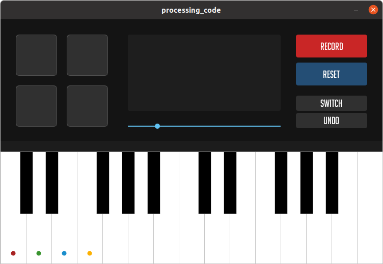

# Mini MIDI Keyboard + LoopStation
A real-time music creation tool for independent musicians to add tracks and loop all of them together. The user-interface includes a 25-key keyboard set and a 4-beat drumset that can be played using switches, a potentiometer and an LDR sensor mounted on Arduino UNO.

### Demonstration
[See video on YouTube](https://youtu.be/yVUETZmOWG4)

### Interface


### The Controller


### Schematic


### Instructions
- As there are only 4 switches to play notes, you can use the potentiometer to drag the range of notes in the interface. The respective colors represent which switch to press in order to play the required note.
- To switch between major & flat notes (white keys) to sharp notes (black keys), you need to put your hand on the top of the LDR sensor attached to the controller.
- To change from Keyboard to Drums, you can click on **SWITCH** button present in the user interface.
- Once you press the **RECORD** button, a new track is added to the loopstation. As you start playing the notes, it will record the note and play it in the next loop. To add another track, you can press **STOP** and then press **RECORD** again.
- If you don't want to add multiple tracks and want to overlay all notes on the same first track, just press **RECORD** in the beginning and play as many notes as you want. This will not create multiple tracks but will create a single track with all pressed notes.
- You can **UNDO** or **RESET** your recordings from the respective buttons from the user interface.
- To change the loop duration, edit ```loopDuration``` variable at the top of Processing program.

### How does it work?
Any data changed on the controller (such as switch press, potentiometer value change, and LDR value change) is communicated through the Serial port used by Arduino UNO. The user interface now renders circular indicators at the mapped position of potentiometer.

The MIDI player will only play the notes when it's not recording. However, it adds the notes to loopstation in case the interface is in recording mode. After recording essential notes, the loopstation plays recored notes at the exact position where the note was recorded (by also displaying the bar visualization).

### Challenges
The main challenge of this project was to make everything ready in quite a short amount of time. Given that I had other final projects and exams, scheduling to work on it was difficult.

Throughout the project, I faced a few minor challenges which I was eventually able to solve:
- The inability of using ```millis()``` over ```frameCount``` in Processing because it'd skip some milliseconds due to high framerate and wouldn't play some recorded notes.
- Sound Distortion: While running the project on Windows, the sounds were being distorted while the loopstation was playing more than a couple of sounds at the same time. I tried using the ```Minim``` library instead, but there was no luck. The issue was gone when I switched back to Ubuntu. Looks like I had problems with my sound driver on Windows.
